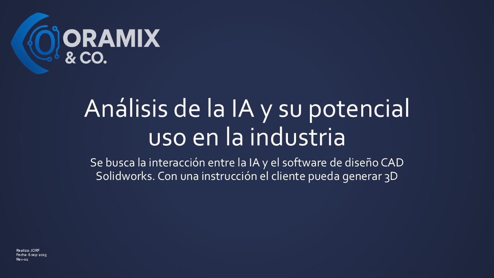

# IA + SolidWorks + KCL: Conveyor paramétrico (Zoo Design Studio)

Este proyecto es un **primer acercamiento para integrar IA en diseño CAD**. Probamos cómo, a partir de instrucciones, se puede generar 3D automático con **Zoo Design Studio (KCL)**. El resultado inicial fue **representativo e incompleto**, así que iteramos y corregimos hasta lograr un **conveyor con rodillos** funcional y paramétrico.

> Visión: dar una instrucción en lenguaje natural y generar el 3D listo; luego **conectar por API/macros a SolidWorks** para crear el modelo automáticamente.  
> Demo relacionado (macros en VBA + SolidWorks): https://youtu.be/LT_uVbWGQ4A?si=VSYsmPzitjHrfXoK

## Proceso
1. **Estructura inicial (incompleta)**  
   _Generada por IA en Zoo (KCL)._  
   

2. **Subensamble de rodillos**  
   _Fila de rodillos paramétrica._  
   

3. **Integración completa**  
   _Correcciones de posición + parámetros; conveyor con rodillos._  
   

4. **Presentación**  
   _Correcciones de posición + parámetros; conveyor con rodillos._  
      

## Archivos
- `kcl_code/Conveyor.kcl` – estructura base  
- `kcl_code/Rodillos.kcl` – rodillos paramétricos  
- `kcl_code/Conveyor_y_rodillos.kcl` – integración final  
- `Imagenes/` – capturas del proceso

## Qué aprendimos
- La IA hoy **no** entrega modelos 100% productivos en Zoo, pero acelera un **borrador inicial**.  
- Con parámetros KCL se logra **variar** largo/ancho/altura/diámetro/espaciamiento de rodillos sin redibujar.  
- Próximo paso: **API/macros** para SolidWorks y flujo **texto → 3D**.

## Autor
**Josué Omar Ramírez Fonseca (Oramix & Co. / MechBot)**  
Exploración de **IA aplicada a CAD** y automatización de diseño industrial.
